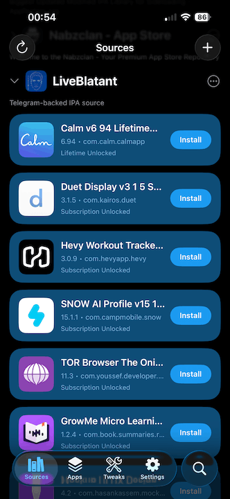
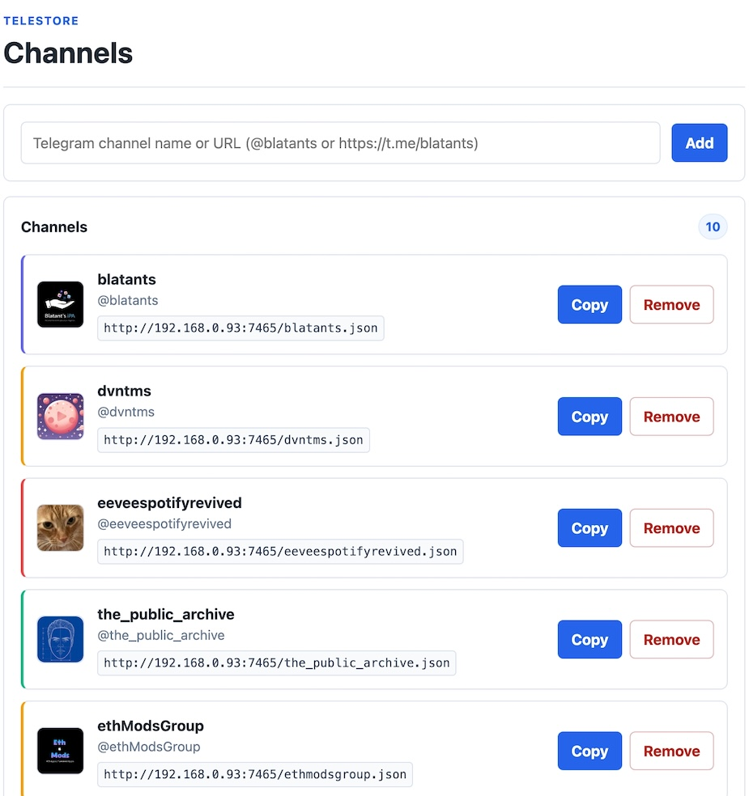

# TeleStore


Self-hosted AltStore / SideStore / LiveContainer repository that streams IPA files from Telegram channels.

No IPA files are stored in this repo. The local server reads Telegram with your own account session and streams files.

> [!NOTE]
> If you are looking to have an IPA repository from Github repos, check out [GithubStore](https://github.com/yazdipour/GithubStore).

## Screenshot of the repo in SideStore and LiveContainer:




## Quick Setup

1. Create Telegram API credentials at https://my.telegram.org/apps.
2. Create `config.yml`: `cp config.example.yml config.yml`

3. Edit `config.yml` and set:

```yaml
telegram:
  api_id: 123456
  api_hash: your_api_hash
  session: /data/telegram.session
  limit: 100

server:
  base_url: http://localhost:8080
  ui_config: false
  ipa_cache_dir: /data/ipa-cache
  ipa_cache_workers: 4
  ipa_cache_global_workers: 8
  ipa_cache_part_size: 8388608

source:
  name: TeleStore
  subtitle: Telegram-backed IPA source
  description: Self-hosted AltStore source that streams IPA files from Telegram.
  tint_color: "#1D9BF0"
  cache_seconds: 600

channels:
  - channel: blatants
    name: Blatants
    slug: blatants
    tint_color: "#1D9BF0"
    icon: imgs/ICON-120-blue.png

  - channel: dvntms
    name: DVNTMS
    slug: dvntms
    tint_color: "#8B5CF6"
    icon: imgs/ICON-120-green.png
```

4. Create `docker-compose.yml`:

```yaml
services:
  app:
    image: ghcr.io/yazdipour/telestore:latest
    ports:
      - "8080:8080" # if port 8080 is in use, change to another port, for example "9090:8080", and set server.base_url to http://localhost:9090
    volumes:
      - telegram-session:/data
      - ./config.yml:/app/config.yml
    restart: unless-stopped
volumes:
  telegram-session:
```


5. Start the server:

```bash
docker compose up -d
```

First run starts even without a Telegram session. Open this URL and log in: `http://localhost:8080/login`

The session is saved in the `telegram-session` Docker volume, so later `docker compose up` runs skip login.

### IPA Repo URLs

Each configured channel gets its own source JSON, named from the source slug:

```text
http://localhost:8080/blatants.json
http://localhost:8080/dvntms.json
```

The legacy first-source URL still works: `http://localhost:8080/source.json`

On an iPhone on the same Wi-Fi, set `server.base_url` to the reachable URL. For example, if your computer LAN IP is `192.168.1.50` and Docker maps host port `8080`:
 `http://192.168.1.50:8080/blatants.json`.

## Configuration

### Download Cache

```yaml
server:
  ipa_cache_dir: /data/ipa-cache
  ipa_cache_workers: 4
  ipa_cache_global_workers: 8
  ipa_cache_part_size: 8388608
```

IPA downloads are cached under `server.ipa_cache_dir` after the first request. Range requests then serve from local disk instead of re-fetching the same bytes from Telegram. On cold range requests, `server.ipa_cache_workers` downloads cache parts concurrently using `server.ipa_cache_part_size` byte chunks. `server.ipa_cache_global_workers` caps total Telegram cache downloads across files.

### Multiple Channels

Define multiple Telegram channels in `config.yml`. App generates one JSON repository per channel, served at `/{slug}.json` (e.g., `/blatants.json`).

```yaml
channels:
  - channel: blatants
    name: Blatants
    slug: blatants
    subtitle: Custom subtitle # Optional override
    description: Custom description # Optional override
    tint_color: "#1D9BF0"
    icon: imgs/ICON-120-blue.png # Optional, defaults to /source-icon.png
```

### Optional Config UI

The channel editor is disabled by default. To enable it, set:

```yaml
server:
  ui_config: true
```

Then open `http://localhost:8080/config` to add or remove channels and copy each channel source URL. New channels use the Telegram handle as the display name, a slugified lowercase handle for the URL, `#1D9BF0` as the tint color, and `imgs/ICON-120-blue.png` as the icon.



## Developer Setup

Use local build when changing source:

```bash
cp config.example.yml config.yml
docker compose -f docker-compose.local.yml up --build
```

## AI Acknowledgment

This project was built with the assistance of AI tools for code generation and refactoring.

## License

MIT License. See [LICENSE](./LICENSE) for details.
