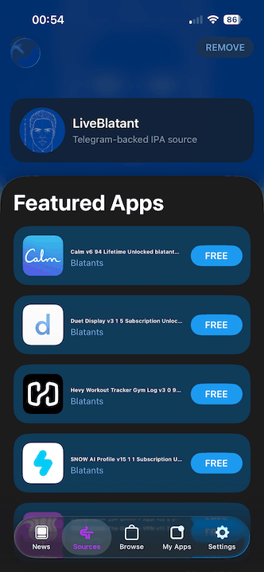

# LiveBlatant


Self-hosted AltStore / SideStore / LiveContainer repository that streams IPA files from Blatants Telegram channel.

No IPA files are stored in this repo. The local server reads Telegram with your own account session and streams files.

## Screenshot of the repo in SideStore and LiveContainer:




## Quick Setup

1. Create Telegram API credentials at https://my.telegram.org/apps.
2. Create `.env`: `cp .env.example .env`

3. Edit `.env` and set:

```env
TELEGRAM_CHANNEL=blatants
TELEGRAM_API_ID=123456
TELEGRAM_API_HASH=your_api_hash
BASE_URL=http://localhost
PORT=8080
TELEGRAM_LIMIT=100 # How many recent channel posts to scan
SOURCE_CACHE_SECONDS=600 # Cache source.json for 10 minutes
```

1. Create `docker-compose.yml`:

```yaml
services:
  app:
    image: ghcr.io/yazdipour/liveblatant:latest
    ports:
      - "${PORT:-8080}:${PORT:-8080}"
    env_file:
      - path: .env
    volumes:
      - telegram-session:/data
    restart: unless-stopped
volumes:
  telegram-session:
```


5. Start:

```bash
docker compose up -d
```

First run starts even without a Telegram session. Open this URL and log in:

```text
http://localhost:${PORT:-8080}/login
```

The session is saved in the `telegram-session` Docker volume, so later `docker compose up` runs skip login.


This builds from local `Dockerfile` instead of pulling GHCR image.

### IPA Repo URL

On the same computer, with the default port: `http://localhost:${PORT:-8080}/source.json`

On an iPhone on the same Wi-Fi, set BASE_URL to your computer LAN IP without the port. The app adds `PORT` automatically. For example, if your computer LAN IP is `192.168.1.50` and `PORT=8080`:
 `http://192.168.1.50:${PORT:-8080}/source.json`.

## Developer Setup

Use local build when changing source:

```bash
cp .env.example .env
docker compose -f docker-compose.local.yml up --build
```

## AI Acknowledgment

This project was built with the assistance of AI tools for code generation and refactoring.

## License MIT License. 

See [LICENSE](./LICENSE) for details.
